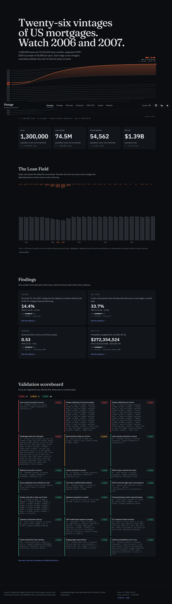
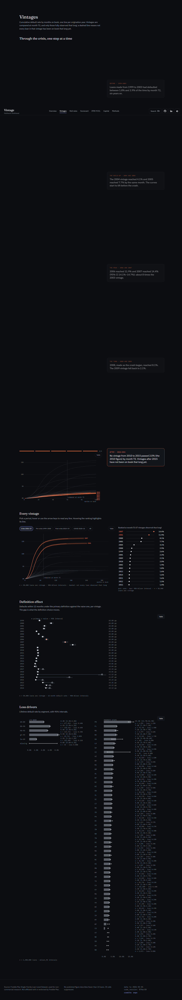
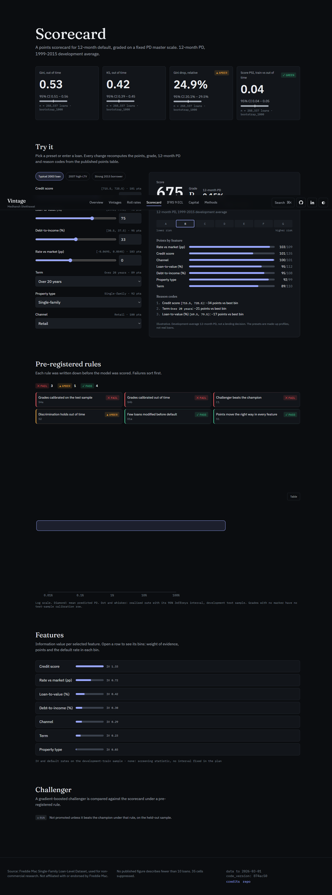
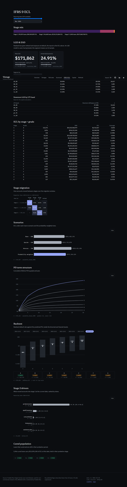
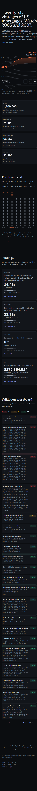

# Vintage

**A credit-risk pack on 27 years of real US mortgage data: a scorecard that ranks risk out of time but is not calibrated, an IFRS 9 / Ind AS 109 loss engine, and a validation report that says so.**

[](https://github.com/Ghostboy789/vintage-credit-risk/actions/workflows/ci.yml)


**[Live site →](https://vintage-credit-risk.vercel.app)** · by **Medhansh Shekhawat** · [LinkedIn](https://www.linkedin.com/in/medhansh-shekhawat) · [GitHub](https://github.com/Ghostboy789)



The data is Freddie Mac's Single-Family Loan-Level Dataset: 1.3 million sampled loans, 74.5 million loan-months, $274.6bn originated, 1999 to March 2026. Every result below was fixed by a validation plan committed before any model was fitted, and every number is read from the committed `artefacts/` folder. Where a rule failed, this page says so.

---

## The finding

> **The scorecard ranks risk out of time (Gini 0.5336 [0.5055, 0.5625]) but does not predict its level. Six of seven grades fail out-of-time calibration, so it should not set cut-offs or provisions.**

| Measure | Result (95% interval) |
|---|---|
| Gini, in time (2015 and earlier originations, held-out) | 0.7109 [0.6855, 0.7354] |
| **Gini, out of time (2017-2024 originations, 258,337 loans)** | **0.5336 [0.5055, 0.5625]** |
| Relative Gini drop | 24.9% [20.1%, 29.5%], amber |
| Out-of-time calibration, realised over predicted | 1.076 [1.007, 1.148] overall; 0.680 [0.592, 0.778] for 2017-2019 and 1.326 [1.229, 1.428] for 2022-2024 |
| Challenger (LightGBM) Gini gain out of time | -0.0124 [-0.0249, -0.0001], not promoted |
| **ECL at 2026-03, probability-weighted** | **$272.4m [269.6, 275.0]** on $80.0bn exposure |
| ECL by stage | Stage 1 $41.0m, stage 2 $124.3m, stage 3 $107.1m |
| ECL by single scenario | $235.7m upside, $261.5m base, $320.4m adverse |

The overall calibration ratio is close to 1 because two windows err in opposite directions: 2017-2019 is over-predicted and 2022-2024 under-predicted. Averaged, they look fine. Grade by grade they do not.

**The interval on the ECL covers parameter uncertainty only, about ±1%. The gap between the upside and adverse scenarios is many times wider and is the better guide to how uncertain the number is.** The stage-2 rule also compares house-price growth defined two different ways, and its effect on the $124.3m stage-2 ECL has not been measured. That alone rules out using the figure. The [committee memo](docs/COMMITTEE_MEMO.md) recommends noting the models as a research benchmark and not approving them for origination, staging or provisioning.

---

## The pre-registered rules

Thresholds were written into [`VALIDATION_PLAN.md`](VALIDATION_PLAN.md) and frozen before any result existed. None was changed to make a result pass. The commit history is the evidence.

### Scorecard: 4 pass, 1 amber, 3 fail

| Rule | Check | Result | Evidence |
|---|---|---|---|
| D1a | Default definition: few loans modified without a primary default | **PASS** | 2,185 modified before or without a primary default against 54,615 primary defaults, 4.0% |
| S1 | Every model feature is monotonic in risk | **PASS** | FICO, LTV, DTI and rate spread; none non-monotonic |
| S2 | Out-of-time Gini holds up against in-time | **AMBER** | 0.7109 in time, 0.5336 out of time, relative drop 0.2494 [0.2010, 0.2951] |
| S3 | Grade default rates rise from A to G | **PASS** | Out of time, A 0.08% to G 1.84%, no inversion |
| S4a | Calibration by grade, in time | **FAIL** | Grade C misses (mean PD 0.28%, realised 0.22% [0.17, 0.27]); the other six pass |
| S4b | Calibration by grade, out of time | **FAIL** | Six of seven grades miss; grade G mean PD 4.48% against realised 1.84% [1.32, 2.49] |
| S5 | Score stability, PSI dev to out of time | **PASS** | 0.0446 [0.0426, 0.0467], green. `channel` and DTI drift red inside it |
| C1 | Challenger promoted only if its Gini gain has a lower bound above +0.02 | **FAIL** | Gain -0.0124 [-0.0249, -0.0001]. The scorecard stays |

C1 failing is the rule working: the challenger did not earn promotion.

### Loss engine: 7 of 7 pass

| Rule | Check | Result |
|---|---|---|
| R5 | Computed loss equals recorded loss within $1 | **PASS**, 19,639 events, largest difference $0.00 |
| R6 | Expenses reconcile within $1 | **PASS**, 36,723 events |
| G2 | LGD model beats an LTV-band mean out of sample | **PASS**, MAE gain -0.0134 [-0.0150, -0.0116] on 16,168 defaults |
| E3 | ECL backtest shows no Red cell | **PASS**, but weak: the band is wide and the model over-predicts in 48 of 49 grade-dates |
| E4a | Three hand-worked loans reproduce the engine | **PASS**, largest difference $0.000000 |
| E4b | Staging edge cases (29 vs 30 days, cure probation, forbearance, credit event) | **PASS** |
| E4c | Marginal default + prepayment + survival sums to 1 | **PASS**, largest deviation 2.2e-15 |

### Data reconciliation: 7 of 8 pass

R1 (mart loan count against the source) **fails by five loans** out of 1,350,000; the cause is explained in [`docs/RECONCILIATION.md`](docs/RECONCILIATION.md). R2, R3, R4, R7 and R8 pass; R5 and R6 are in the table above.

The full [validation report](docs/VALIDATION_REPORT.md) and the [issue ledger](docs/VALIDATION_ISSUES.md) (20 items, each with severity and status, several still open) go through every result.

---

## The live site

**[vintage-credit-risk.vercel.app](https://vintage-credit-risk.vercel.app)** is a static React site built from `artefacts/`. Overview, Vintages, Roll rates, Scorecard (with a points calculator that runs in the browser), IFRS 9 ECL, Capital, and a Methods and limits page.

| | |
|---|---|
| **Vintages** · cumulative default and loss by months on book | **Scorecard** · points table, grades, the out-of-time drop |
|  |  |
| **IFRS 9 ECL** · stages, scenarios, backtest | **Overview on mobile** |
|  |  |

Build notes are in [`docs/site/README.md`](docs/site/README.md). The release build refuses to run if any artefact is flagged synthetic.

---

## What the portfolio shows

- **Vintages.** The crisis vintages drive historical losses: the 2007 vintage reached a cumulative default rate of 14.41% [14.11, 14.72] at 72 months on book (n 50,000).
- **Loss drivers.** Loss rate rises with origination LTV, from 0.11% of original balance at LTV up to 60 to 1.05% above 95 (intervals in `artefacts/portfolio.json`). It is not monotone in every band, it is univariate, mortgage insurance is not netted, and it is not causal.
- **Current book.** At 2026-03, stage 2 holds 46,668 loans and $124.3m of the ECL; 89.7% [89.4, 90.0] of those loans are there through the PD rule alone, not delinquency.

More in [`docs/FINDINGS.md`](docs/FINDINGS.md), including what did not hold up.

---

## How it is built

Portfolio logic (the loan-month panel, days-past-due buckets, default, cure and prepay flags, exposure, loss inputs, vintages, roll rates) lives in dbt SQL. Python does extraction, modelling, statistics, the workbook and serving.

```
Freddie Mac text files -> extract/ (typed Parquet)
  -> dbt: staging -> intermediate -> marts, plus a MetricFlow metrics layer
       staging       stg_freddie__origination, stg_freddie__performance
       intermediate  int_loan_month, int_default_events, int_loan_resolution,
                     int_loss_events, int_market_rate
       marts         dim_loan, dim_date, fct_loan_month, fct_default_events,
                     fct_loss_events, fct_roll_rates, fct_vintage_curve,
                     fct_scorecard_base, fct_stage_inputs, fct_ecl, metrics_monthly
  -> models/pd (scorecard, challenger)  models/loss (LGD, lifetime PD, ECL, capital)
  -> analysis/portfolio (vintages, roll rates, monitoring)
  -> artefacts/*.json -> web/ site, excel/ workbook, powerbi/ export
```

**Metrics** (MetricFlow, `dbt/models/semantic/_semantic.yml`): active loans, total UPB, ECL total, delinquency rate 30+, delinquency rate 90+, default rate, loss rate and coverage ratio. `tests/test_dbt.py` recomputes them directly in SQL and checks every month.

**Default definition.** Primary default is 90+ days past due or a credit event. A naive definition and the COVID forbearance exemption are run alongside as sensitivities. Both change measured default rates, and the effect is reported by vintage.

**Staging.** Stage 3 is primary default. Stage 2 is 30+ days past due, a PD-deterioration rule (2.0x the origination PD and +0.20 points, thresholds set in this project), or forbearance and a six-month cure probation. Scenarios (base 60%, adverse 25%, upside 15%) come from the FHFA national house-price index.

### Ind AS 109 and RBI mapping

| Step here | Ind AS 109 / IFRS 9 | Indian practice |
|---|---|---|
| Stage 3 = 90+ days past due or credit event | Credit-impaired; 90 days is the rebuttable default presumption | RBI NPA: overdue more than 90 days |
| Stage 2 backstop at 30+ days past due | 30 days is the rebuttable SICR presumption | SMA-1 (31-60) and SMA-2 (61-90) sit in stage 2; SMA-0 cannot be separated in this data |
| PD-deterioration rule against origination PD | SICR compares lifetime default risk now with initial recognition | Lenders under Ind AS usually add a PD or rating-notch test; the thresholds here are this project's, not a regulatory number |
| Forbearance and cure probation in stage 2 | Qualitative SICR indicators | RBI restructuring keeps an account downgraded for a period; here it is 6 months after a cure |
| 12-month ECL (stage 1), lifetime (stages 2, 3) | 5.5.3, 5.5.5 | Same under Ind AS 109 |
| Illustrative IRB capital | Basel retail mortgage formula | RBI has not implemented IRB; banks use the standardised approach |

Indian banks provision under RBI's IRAC norms, not Ind AS 109 ECL. The mapping shows how the method carries over; it is not a view on how any Indian lender should provision. Detail in [`docs/LOSS_AND_ECL.md`](docs/LOSS_AND_ECL.md).

### Excel and Power BI

- **[`excel/vintage_ecl_workbook.xlsx`](excel/vintage_ecl_workbook.xlsx)**: a live-formula scorecard, ECL aggregation and sensitivity. `tests/test_workbook.py` recalculates it and checks it against the artefacts.
- **[`powerbi/`](powerbi/README.md)**: a Power BI project (TMDL model, PBIR report) reading exported aggregates from `powerbi/data`. It has not been rendered or checked against the DAX queries in Power BI Desktop yet, so treat it as unverified.

---

## What this does not establish

- **Not a production model.** No calibration on out-of-time data was allowed by the validation plan, so the PD is not usable as a point-in-time estimate. Provisioning here uses a separate lifetime PD, which limits the damage, but the stage-2 problem above remains.
- **One out-of-time period.** 2017-2024 originations, and the 2017-2019 window is mostly 2017 and 2018.
- **The ECL interval is narrow by construction.** It reflects parameter draws only, not model or scenario uncertainty.
- **The ECL backtest is a weak test.** It passes against a wide band, over-predicts in benign years, and reacted late in 2008.
- **US conforming mortgages only.** No reject inference, no Indian loans, and every relationship is an association, not a causal effect.
- **Some intervals treat repeated loan observations as independent** (V-07), so they are somewhat too tight.
- **Not an audited or regulatory figure**, and not a view on any real lender's provisions.

---

## Run it

The data cannot be redistributed, so you fetch it yourself.

1. Register on Freddie Mac's [Single-Family Loan-Level Dataset](https://www.freddiemac.com/research/datasets/sf-loanlevel-dataset) page (free) and accept its terms, which restrict use to non-commercial research.
2. Download the sample files (`sample_YYYY.zip`, one per origination year) into `data/raw/`.
3. Point the code at your checkout with `VINTAGE_DATA_ROOT` if it is not the repo folder. Real data, marts and model outputs are gitignored.

```bash
python -m venv .venv && .venv/Scripts/pip install -r requirements.txt
python scripts/extract_all_years.py           # zips -> typed Parquet in data/parquet
cd dbt && dbt build --target local --profiles-dir .   # DuckDB over the real Parquet; set VINTAGE_LOCAL_DB and VINTAGE_DUCKDB_TEMP
python scripts/export_marts.py --target local --duckdb-path <your .duckdb>
python -m models.pd.run                       # scorecard and challenger
python -m models.loss.run                     # LGD, EAD, ECL, capital
python -m analysis.portfolio                  # vintages, roll rates
python scripts/build_workbook.py              # Excel workbook
cd web && bun install && bun run build        # site
pytest                                        # runs on synthetic fixtures, no data needed
```

CI runs `ruff` and `pytest`, which build and test the dbt project on DuckDB over synthetic fixtures; it never touches real data. The committed `artefacts/` are the aggregates every page and workbook reads, so the site and the tests run from a clean clone.

## Layout

```
extract/      raw text files to typed Parquet
dbt/          staging, intermediate, marts, MetricFlow metrics
models/pd     WoE/IV scorecard, LightGBM challenger, discrimination and calibration
models/loss   LGD, EAD, lifetime PD, ECL, illustrative IRB capital
analysis/     vintage curves, roll rates, monitoring
artefacts/    published aggregate JSON (contracts in CONTRACTS.md)
excel/        the ECL workbook
web/          the static site
powerbi/      Power BI project and exported data
docs/         validation report, issue ledger, committee memo, findings, data licence
tests/        pytest suite; fixtures are synthetic only
```

## Data and credit

Source: Freddie Mac Single-Family Loan-Level Dataset, used under Freddie Mac's terms for non-commercial research. Only aggregates are published, and no cell describes fewer than 10 loans. See [`docs/DATA_LICENCE.md`](docs/DATA_LICENCE.md).

*Vintage is an independent, non-commercial analysis and is not affiliated with or endorsed by Freddie Mac.*
